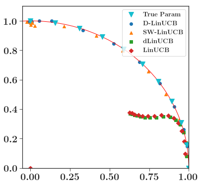
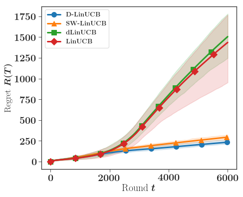

# WeightedLinearBandits

# Description

Code associated with the [NeurIPS19](https://nips.cc) paper *Weighted Linear Bandits in Non-Stationary Environments* available [here](https://arxiv.org/abs/1909.09146). The article is a joint work with Claire Vernade and Olivier Cappé.

This package implements the `D-LinUCB` algorithm presented in the paper. This algorithm builds an estimate of the unkwown vector of the linear model based on weighted least-squares rather than least-squares. By doing so, the new estimate is more robust to non-stationarity.

The empirical performance of the algorithm is reported in two simulated experiments. Those experiments can be easily reproduced by cloning the package, and running the Jupyter notebook in the [Experiment](Experiments/) folder.

# Experiments

## Abruptly changing environment

### Plots

### Comments
This experiment can be found on [this notebook](Experiments/exp_ABRUPT_ENV_NEW.ipynb). In this experiment, the unknown parameter is jumping at different places on the unit circle as can be seen on the scatter plot. We compare the regret of the different policies that were implemented. When the environment is highly noisy, the detection algorithm `dLinUCB` created in [*Learning Contextual Bandits in a Non-stationary Environment*](https://arxiv.org/abs/1805.09365) fails to detect changepoints but the `D-LinUCB`and `SW-LinUCB` policies are more robust to those changes. The red dashed lines correspond to the different breakpoints and the blue dashed line is the average detection time of the breakpoint for the `dLinUCB`algorithm.

## Slowly-varying environment
### Plots

### Comments
One of the main advantage of our method compared to changepoint detection is that the algorithm produces an estimate that is also robust to slowly-varying parameters. In this environment even with a low level of noise, it is hard for an detection algorithm to see the changes. In this experiment, the unknown parameter starts at [0,1] and moves continuously counter-clockwise on the unit-circle up to the position [0,1] in 3000 steps. We then have a 3000 steps steady period.

# Contact

Please contact yoanrussac@ens.fr for any further information.
