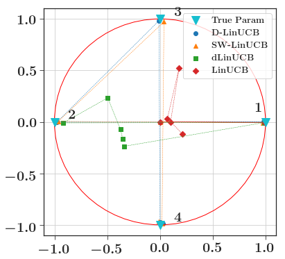

# WeightedLinearBandits

# Description

Code associated with the [NeurIPS19](https://nips.cc) paper *Weighted Linear Bandits in Non-Stationary Environments* available [here](https://arxiv.org/abs/1909.09146). The article is a joint work with Claire Vernade and Olivier Cappé.

This package implements the `D-LinUCB` algorithm presented in the paper. This algorithm builds an estimate of the unkwown vector of the linear model based on weighted least-squares rather than least-squares. By doing so, the new estimate is more robust to non-stationarity.

The empirical performance of the algorithm is reported in two simulated experiments. Those experiments can be easily reproduced by cloning the package, and running the Jupyter notebook in the [Experiment](Experiments/) folder.

# Experiments

## Abruptly changing experiment

### Plots

### Comments
This experiment can be found on [this notebook](Experiments/exp_ABRUPT_ENV_NEW.ipynb). In this experiment, the unknown parameter is jumping at different places on the unit circle as can be seen on the scatter plot. We compare the regret of the different policies that were implemented. When the environment is highly noisy, the detection algorithm `dLinUCB` created [in](https://arxiv.org/abs/1805.09365) fails to detect changepoints but the `D-LinUCB`and `SW-LinUCB` policies are more robust to those changes. The red dashed lines correspond to the different breakpoints and the blue dashed line is the average detection time of the breakpoint for the `dLinUCB`algorithm.

